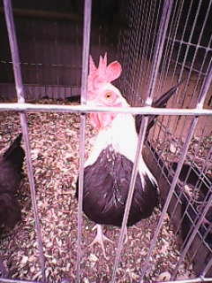
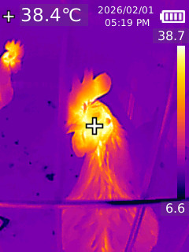
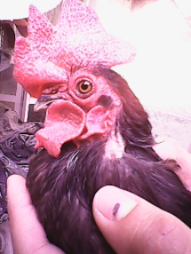
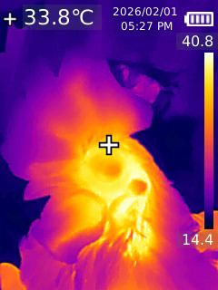

<div align="center">

|  | <h1 align="center">🐔 MPA<br><sub>Monitoreo para la Prevención de Enfermedades Avícolas</sub></h1> |  |
| :--- | :---: | ---: |

> **Sistema de monitoreo ambiental inteligente** para la detección temprana de condiciones críticas en granjas avícolas.

---

<p align="center">
   
   
   
   
  
</p>

---

<div align="center">

### 👥 Equipo de Trabajo

**Alexis Villegas Alvarado** • **Emmanuel Urrutia Carrazco** • 
**Daniel Emiliano Lopez Rivera** • **Ismael Cuautle Villalobos**

<p align="center">
  🏭 <b>TSU Manufactura Flexible</b>  •   ⚡ <b>Instalaciones Eléctricas Industriales</b>  
  <br>
  🏛️ <i>Universidad Tecnológica de Tehuacán</i>
</p>

</div>

---

## 📌 ¿Qué es MPA?

**MPA** es un sistema embebido e inteligente que supervisa en tiempo real las variables ambientales más críticas en entornos avícolas: temperatura, concentración de amoniaco y distribución térmica de las aves.

El proyecto nace de la necesidad de **detectar condiciones anómalas antes de que se conviertan en brotes de enfermedad**, reduciendo pérdidas económicas y mejorando el bienestar animal mediante tecnología accesible y datos estructurados.

---

## 📷 Dataset — Muestras Reales

Las siguientes imágenes forman parte del dataset construido para el proyecto. Cada sujeto es fotografiado en **imagen normal** e **imagen térmica** de forma simultánea para correlacionar temperatura corporal con estado de salud.

### 🐓 Muestra 1

<div align="center">

| Imagen Normal | Imagen Térmica |
|:---:|:---:|
|  |  |
| Vista en jaula — sujeto en reposo | Análisis de distribución térmica |

</div>

### 🐓 Muestra 2

<div align="center">

| Imagen Normal | Imagen Térmica |
|:---:|:---:|
|  |  |
| Vista de cresta y cara — inspección directa | Temperatura superficial facial |

</div>

> 📁 Dataset completo disponible en [`/DATA_SET-POLLOS`](./DATA_SET-POLLOS)

---

## 🎯 Objetivos

| # | Objetivo |
|---|----------|
| 1 | Monitorear temperatura ambiental con sensores industriales Modbus |
| 2 | Detectar concentraciones peligrosas de amoniaco (NH₃) |
| 3 | Analizar patrones térmicos con cámara termográfica UNI-T |
| 4 | Registrar datos estructurados para análisis histórico |
| 5 | Construir un dataset confiable para modelos predictivos futuros |
| 6 | Prevenir brotes mediante detección temprana de anomalías |

---

## 🏗️ Arquitectura del Sistema
```
┌─────────────────────────────────────────────────────────────┐
│                    CAPA DE ADQUISICIÓN                      │
│                                                             │
│  [Sensor Temp. Industrial]──RS485/Modbus──┐                 │
│  [Sensor NH₃ Amoniaco]────────────────────┼──► [Arduino]   │
│  [Cámara Termográfica UNI-T]──────────────┘                 │
└─────────────────────────┬───────────────────────────────────┘
                          │ Serial / USB
┌─────────────────────────▼───────────────────────────────────┐
│                   CAPA DE PROCESAMIENTO                     │
│                                                             │
│   Python ──► Recepción Serial                               │
│           ──► Validación y filtrado de datos                │
│           ──► Almacenamiento (.csv / .txt)                  │
│           ──► Generación de gráficas por variable           │
│           ──► Detección de valores fuera de rango           │
└─────────────────────────┬───────────────────────────────────┘
                          │
┌─────────────────────────▼───────────────────────────────────┐
│                     DATASET / ANÁLISIS                      │
│                                                             │
│   📁 DATA_SET-POLLOS/ ──► Imágenes normales + térmicas      │
│   📊 Gráficas temporales por variable                       │
│   🔍 Registros estructurados por sesión                     │
└─────────────────────────────────────────────────────────────┘
```

---

## ⚙️ Stack Tecnológico

<div align="center">

| Componente | Tecnología | Rol |
|-----------|-----------|-----|
| 🔌 Microcontrolador | Arduino | Adquisición y control |
| 🌡️ Sensor de temperatura | Industrial RS485 | Medición ambiental |
| 🌫️ Sensor de amoniaco | NH₃ analógico/digital | Detección de gas |
| 📷 Cámara térmica | UNI-T | Análisis térmico de aves |
| 📡 Protocolo | Modbus RTU (RS485) | Comunicación industrial |
| 🐍 Procesamiento | Python | Análisis y almacenamiento |

</div>

---

## 📁 Estructura del Repositorio
```
MPA-Monitoreo-para-la-prevencion-de-enfermedades-avicolas-/
│
├── 📂 DATA_SET-POLLOS/               # Imágenes normales (.jpg) y térmicas (.bmp)
│   ├── IMG_0002.jpg
│   ├── IMG_0002.BMP
│   ├── IMG_0016.jpg
│   ├── IMG_0016.BMP
│   └── ...
├── 📂 PROGRAMAS-PROYECTO-MPA/        # Código fuente (Arduino + Python)
├── 📄 plan de trabajo para mpa.txt   # Planificación del proyecto
├── 📄 README.md
└── 📄 .gitignore
```

---

## 🚀 Estado Actual del Proyecto
```
[████████░░░░░░░░░░░░] 40% — En desarrollo activo
```

- ✅ Comunicación Modbus RTU con sensores industriales
- ✅ Lectura de sensor de amoniaco
- ✅ Captura de imágenes normales y térmicas para dataset
- ✅ Almacenamiento de datos en `.csv`
- 🔧 Calibración y validación de sensores
- 🔧 Estructuración y etiquetado del dataset
- ⏳ Sincronización de datos térmicos con variables ambientales

---

## 🔭 Proyección Futura

| Fase | Feature | Estado |
|------|---------|--------|
| 1 | Adquisición de datos multi-sensor | 🔧 En progreso |
| 2 | Dataset etiquetado (normal / anómalo) | 🔧 En progreso |
| 3 | Dashboard de monitoreo local | ⏳ Pendiente |
| 4 | Sistema de alertas automáticas | ⏳ Pendiente |
| 5 | Modelo predictivo con ML | ⏳ Pendiente |
| 6 | Integración IoT / monitoreo remoto | ⏳ Pendiente |

---

## 🧠 Impacto Esperado

- 🐔 **Reducción de pérdidas** por enfermedades avícolas evitables
- 🌿 **Mejora del bienestar animal** mediante control ambiental proactivo
- 📊 **Base tecnológica** para la avicultura inteligente en México
- 🔬 **Integración real** de electrónica industrial con ciencia de datos
- 🎓 **Aporte académico** desde la ingeniería mecatrónica aplicada

---

## 👨‍💻 Autor

<div align="center">

**Alexis Villegas Alvarado**  
TSU Manufactura Flexible 
Universidad Tecnológica de Tehuacán

[](https://github.com/golfish17)

</div>

---

## 📄 Licencia


---

<div align="center">

*Proyecto MPA — Avicultura inteligente con tecnología accesible* 🐔📡

</div>
